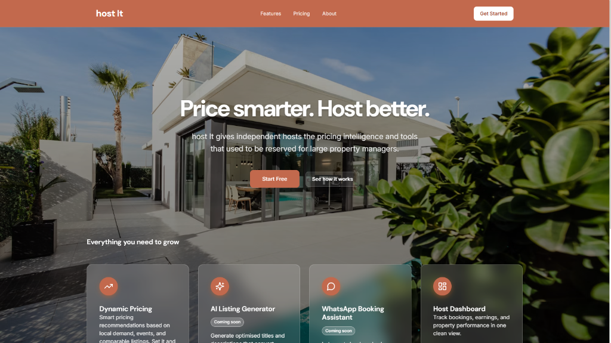
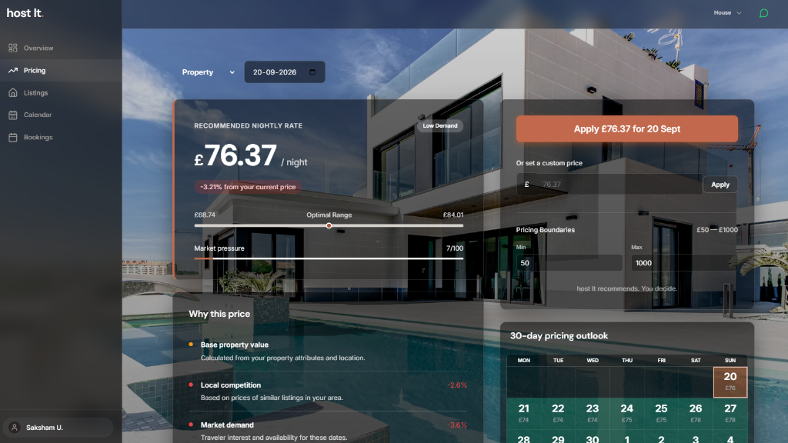
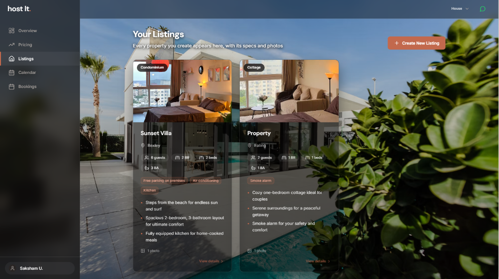
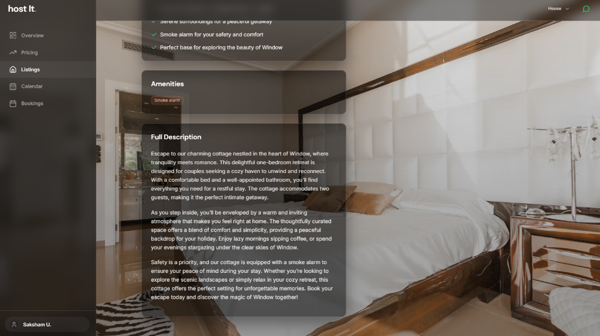
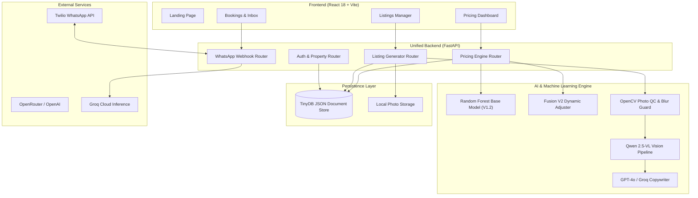

<div align="center">

# 🏡 host It.
### **AI-Powered Short-Term Rental Operating System**

*Price smarter. Host better. Enterprise-grade dynamic pricing intelligence, automated multimodal listing generation, and 24/7 conversational guest booking intake — built for independent hosts.*

---

[](https://github.com)
[](frontend/)
[](api/)
[](src/pricing/)
[](src/listings/)
[](api/whatsapp_router.py)

<br/>



</div>

<br/>

## 📖 Overview

**host It.** is an end-to-end, production-ready SaaS platform engineered to give independent short-term rental hosts the algorithmic edge previously reserved for large corporate property managers. 

By unifying machine learning property valuation, real-time market pressure analytics, automated multimodal listing generation, and an automated WhatsApp booking receptionist into a single cohesive system, **host It.** maximizes occupancy and revenue while slashing host operational overhead to near zero.

---

## ✨ Core Features & Platform Showcase

### 1. 📈 Machine Learning Dynamic Pricing Engine (Fusion V2)
The core pricing engine combines a trained **Random Forest regressor** with a date-aware **Fusion V2 heuristic layer**. It calculates baseline property valuations from structural features, then dynamically adjusts rates based on live market pressure scores, local competitor density, day-of-week demand, and London event calendars.

* **Smart Rate Recommendations:** Real-time optimal nightly rates with confidence intervals and boundary guardrails ($£\text{Min} - £\text{Max}$).
* **Market Pressure Analytics:** Continuous 0–100 demand index derived from local availability rates.
* **30-Day Forward Outlook:** Interactive calendar projecting nightly rate fluctuations and seasonal shifts.
* **Transparent Breakdown:** Hosts see exactly why a price was recommended (Base Value, Local Competition %, Market Demand %).

<br/>

<div align="center">
  
  <p><em>Real-time dynamic pricing dashboard with optimal range bounds, market pressure metrics, and 30-day projection calendar.</em></p>
</div>

<br/>

---

### 2. 📋 Multi-Property Listings Portfolio
Manage your entire real-estate portfolio from a unified, glassmorphic host command center. 

* **Comprehensive Specs at a Glance:** Instant visibility into guest capacity, bedroom/bed count, bathrooms, and canonical amenity flags.
* **Visual Media Hub:** High-resolution photo asset galleries per property.
* **Streamlined Onboarding:** Intuitive new listing creation flow with immediate database synchronization.

<br/>

<div align="center">
  
  <p><em>Host property catalog displaying active listings with spec summaries, verified amenities, and quick detail navigation.</em></p>
</div>

<br/>

---

### 3. 🎨 Multimodal AI Auto-Listing Studio
Turning raw property photos and basic specs into high-converting Airbnb listings in seconds through an automated 3-stage intelligence pipeline:

1. **Stage 1 — Photo Quality Assurance (QC):** Computer vision filters (OpenCV variance-of-Laplacian / PyIQA) identify blurry, poorly lit, or low-resolution images before ingestion.
2. **Stage 2 — Vision Feature Extraction:** Vision-Language Models (**Qwen 2.5-VL**) inspect uploaded room photos to extract architectural style, natural lighting, furniture quality, and hidden amenities.
3. **Stage 3 — Copywriting Generation:** An LLM writer synthesizes visual findings with host inputs to produce punchy titles, conversion-driven highlights, and complete guest-ready descriptions.

<br/>

<div align="center">
  
  <p><em>AI-synthesized listing detail page showcasing generated descriptions, curated highlight bullets, and verified safety amenities.</em></p>
</div>

<br/>

---

### 4. 💬 24/7 Conversational WhatsApp Booking Assistant
Direct bookings made frictionless. Using Twilio's WhatsApp Business API coupled with ultra-fast LLM inference via **Groq (Llama 3)**, incoming guest inquiries are parsed and triaged automatically.

* **Intent & Entity Extraction:** Automatically extracts guest intent, check-in/out dates, guest counts, and budget offers from raw chat messages.
* **Automated Host Replies:** Formulates natural, hospitable responses confirming availability and guiding guests to complete their booking.
* **Centralized Booking Queue:** Instantly queues inquiries directly into the host dashboard.

---

## 🏛 System Architecture

The platform is designed with a high-performance decoupled architecture: a modern Vite/React single-page application communicating with an asynchronous FastAPI backend backed by a lightweight, zero-configuration TinyDB document store and pre-trained machine learning pipelines.



---

## 🔬 Pricing Methodology & ML Pipeline

The pricing architecture executes a two-phase hybrid valuation model:

$$\text{Final Price} = \text{Clamp}\Big(\text{Base Price}_{\text{RF}} \times (1 + \Delta_{\text{market}} + \Delta_{\text{comp}} + \Delta_{\text{weekend}} + \Delta_{\text{event}}), \; P_{\min}, \; P_{\max}\Big)$$

1. **Phase 1 — Base Property Valuation (Random Forest V1.2):**
   * Pre-trained on London short-term rental market datasets.
   * Transforms structural features: property type, room configuration, guest capacity, bedroom/bathroom ratios, geographic coordinates, and distance to Central London.
   * Maps 30+ canonical amenity binary flags into property valuation weights.

2. **Phase 2 — Fusion V2 Date-Aware Dynamic Adjustment:**
   * **Market Pressure ($\Delta_{\text{market}}$):** Computes an unavailability ratio score $[0, 100]$ for the target date to measure city-wide occupancy pressure.
   * **Local Comparables ($\Delta_{\text{comp}}$):** Compares pricing against similar active listings within the same neighborhood cluster.
   * **Weekend & Seasonality ($\Delta_{\text{weekend}}$):** Applies day-of-week premiums for high-demand Friday/Saturday stays.
   * **Events & Holidays ($\Delta_{\text{event}}$):** Ingests local London event calendars to capture festival and holiday demand spikes.
   * **Host Guardrails:** All outputs are strictly clamped within user-defined $[\text{Min Price}, \text{Max Price}]$ safety boundaries.

---

## 💻 Tech Stack

| Domain | Technology | Details |
| :--- | :--- | :--- |
| **Frontend Framework** | **React 18** | High-performance SPA with modern hooks and modular component architecture |
| **Build & Tooling** | **Vite 5** | Lightning-fast HMR and optimized production bundling |
| **Styling & UI** | **Custom CSS & Lucide** | Glassmorphic dark/luxury theme with responsive layout and Lucide React icons |
| **Backend API** | **FastAPI** | Asynchronous, auto-documenting Python REST API |
| **Package Manager** | **uv** | Ultra-fast Rust-based Python package manager and workspace orchestrator |
| **Machine Learning** | **scikit-learn, NumPy, Pandas** | Random Forest Regressor, feature transformers, and time-series date adjusters |
| **Model Persistence** | **Joblib, Gzip** | Compressed serialized pipeline artifacts (`best_pricing_model_v1_2.pkl.gz`) |
| **Computer Vision** | **OpenCV & PyIQA** | Variance-of-Laplacian blur detection and image quality scoring |
| **Generative Vision & NLP** | **Qwen 2.5-VL & GPT-4o-mini** | Multimodal room analysis and automated promotional listing copy generation |
| **Chat & Webhooks** | **Twilio & Groq** | WhatsApp incoming/outgoing messaging with ultra-low latency Llama-3 inference |
| **Database** | **TinyDB** | Document store managing properties, saved listings, users, and booking states |

---

## 📂 Project Structure

```
.
├── api/
│   ├── main.py                     # Unified FastAPI application entry point
│   ├── whatsapp_router.py          # Twilio WhatsApp webhook & Groq LLM parser
│   └── pyproject.toml              # API-specific dependencies
├── src/
│   ├── pricing/                    # Dynamic Pricing Engine
│   │   ├── pricing_engine.py       # Base RF inference + Fusion V2 dynamic adjuster
│   │   ├── comparables.py          # Neighbor comp matching algorithms
│   │   ├── events.py               # London holiday and event calendar rules
│   │   └── neighbourhood_price_stats.json
│   ├── listings/                   # AI Auto-Listing Pipeline
│   │   └── pipeline.py             # Photo QC -> Qwen 2.5-VL Vision -> LLM Writer
│   └── features/                   # Feature Engineering
│       └── property_transformer.py # Raw property attributes to ML feature vector
├── models/
│   └── best_pricing_model_v1_2.pkl.gz  # Trained Random Forest pricing artifact
├── frontend/
│   ├── src/
│   │   ├── pages/                  # Landing, Dashboard, Pricing, Listings, Bookings
│   │   ├── components/             # Reusable UI controls, calendars, charts, layouts
│   │   └── api/                    # Axios/fetch service layers
│   ├── package.json
│   └── vite.config.js
├── data/
│   ├── demo/                       # Demo user accounts, listings, and stored media
│   └── raw/                        # London Airbnb calendar & listing training data
├── docs/
│   └── screenshots/                # Platform application screenshots
├── pyproject.toml                  # Root uv project workspace config
└── README.md
```

---

## 🚀 Getting Started

### Prerequisites
* **Python 3.11+**
* **Node.js 18+** and **npm**
* **[uv](https://docs.astral.sh/uv/)** (recommended Python package manager)

### 1. Clone & Configure Environment

```bash
git clone https://github.com/your-username/host-it.git
cd host-it
```

Create a `.env` file in the project root:

```env
# AI Model APIs (OpenRouter or OpenAI)
OPENROUTER_API_KEY=your_openrouter_or_openai_key
VISION_MODEL=qwen/qwen-2.5-vl-72b-instruct
WRITER_MODEL=openai/gpt-4o-mini

# Conversational Booking Assistant (Groq & Twilio)
GROQ_API_KEY=your_groq_api_key
TWILIO_ACCOUNT_SID=your_twilio_sid
TWILIO_AUTH_TOKEN=your_twilio_token
```

---

### 2. Backend Installation & Startup

Using `uv` for seamless dependency resolution:

```bash
# Sync dependencies and create virtualenv
uv sync

# Run the FastAPI server
uv run uvicorn api.main:app --reload --host 0.0.0.0 --port 8000
```

> **Optional Image QC Extras:** If you wish to enable PyTorch and PyIQA-based deep image quality scoring:
> ```bash
> uv sync --extra image-qc
> ```

The API documentation is interactively available at `http://localhost:8000/docs`.

---

### 3. Frontend Installation & Startup

In a new terminal window:

```bash
cd frontend
npm install
npm run dev
```

Open your browser and navigate to **`http://localhost:5173`** to access the complete application.

---

## 🔌 API Reference Highlights

| Method | Endpoint | Description |
| :--- | :--- | :--- |
| `POST` | `/api/auth/login` | Authenticate host credentials |
| `GET` | `/api/properties` | Fetch host properties with specs and metadata |
| `POST` | `/api/pricing/recommend` | Generate dynamic nightly rate recommendation for any property and date |
| `POST` | `/api/listings/generate` | Run the 3-stage multimodal AI listing generation pipeline |
| `POST` | `/api/listings/save` | Persist generated listing details and photo assets to the database |
| `GET` | `/api/listings` | Retrieve all verified active listings |
| `GET` | `/api/listings/{id}` | Detailed property overview with pricing metrics and photo gallery |
| `POST` | `/api/whatsapp/webhook` | Twilio webhook handling inbound guest inquiries with Groq AI extraction |
| `GET` | `/api/bookings` | Retrieve centralized real-time incoming guest booking queue |

---

## 👥 Authors & Acknowledgments

* **Lead Development:** [Saksham U.](https://github.com/)
* **Datasets:** London Market Data sourced from Inside Airbnb.
* **Model Frameworks:** Built with Scikit-Learn, FastAPI, React, and OpenRouter AI.

---

<div align="center">
  <sub>Built with precision for the next generation of independent hospitality hosts.</sub>
</div>
